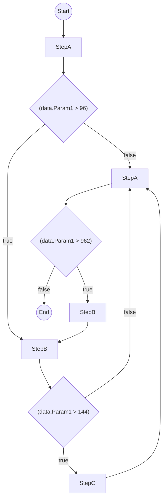

```mermaid
flowchart TB
startNode((Start))
0[StepA]
1{"(data.Param1 > 96)"}
2[StepB]
3{"(data.Param1 > 144)"}
4[StepC]
5[StepA]
6{"(data.Param1 > 962)"}
7[StepB]
8((End))

startNode --> 0
0 --> 1
1 -->|false| 5
1 -->|true| 2
2 --> 3
3 -->|false| 5
3 -->|true| 4
4 --> 5
5 --> 6
6 -->|false| 8
6 -->|true| 7
7 --> 2
```
