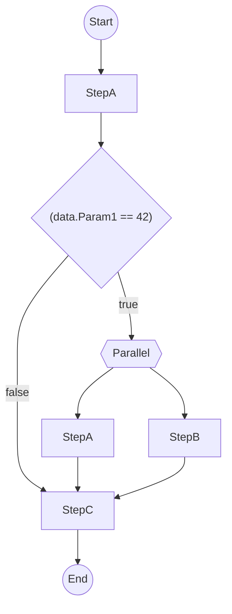

```mermaid
flowchart TB
startNode((Start))
0[StepA]
1{"(data.Param1 == 42)"}
3{{Parallel}}
4[StepA]
5[StepB]
6[StepC]
7((End))

startNode --> 0
0 --> 1
1 -->|false| 6
1 -->|true| 3
3 --> 4
3 --> 5
4 --> 6
5 --> 6
6 --> 7
```
