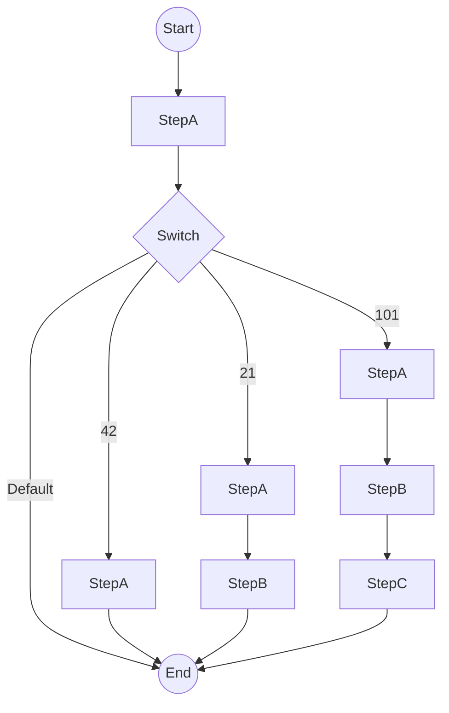

```mermaid
flowchart TB
startNode((Start))
0[StepA]
1{Switch}
3[StepA]
5[StepA]
6[StepB]
8[StepA]
9[StepB]
10[StepC]
11((End))

startNode --> 0
0 --> 1
1 -->|Default| 11
1 -->|42| 3
1 -->|21| 5
1 -->|101| 8
3 --> 11
5 --> 6
6 --> 11
8 --> 9
9 --> 10
10 --> 11
```
