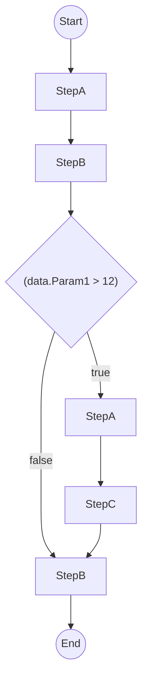

```mermaid
flowchart TB
startNode((Start))
0[StepA]
1[StepB]
2{"(data.Param1 > 12)"}
3[StepA]
4[StepC]
5[StepB]
6((End))

startNode --> 0
0 --> 1
1 --> 2
2 -->|false| 5
2 -->|true| 3
3 --> 4
4 --> 5
5 --> 6
```
