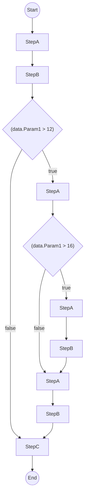

```mermaid
flowchart TB
startNode((Start))
0[StepA]
1[StepB]
2{"(data.Param1 > 12)"}
3[StepA]
4{"(data.Param1 > 16)"}
5[StepA]
6[StepB]
7[StepA]
8[StepB]
9[StepC]
10((End))

startNode --> 0
0 --> 1
1 --> 2
2 -->|false| 9
2 -->|true| 3
3 --> 4
4 -->|false| 7
4 -->|true| 5
5 --> 6
6 --> 7
7 --> 8
8 --> 9
9 --> 10
```
