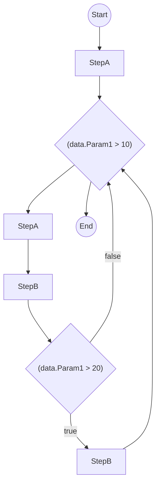

```mermaid
flowchart TB
startNode((Start))
0[StepA]
1{"(data.Param1 > 10)"}
2[StepA]
3[StepB]
4{"(data.Param1 > 20)"}
5[StepB]
6((End))

startNode --> 0
0 --> 1
1 --> 6
1 --> 2
2 --> 3
3 --> 4
4 -->|false| 1
4 -->|true| 5
5 --> 1
```
